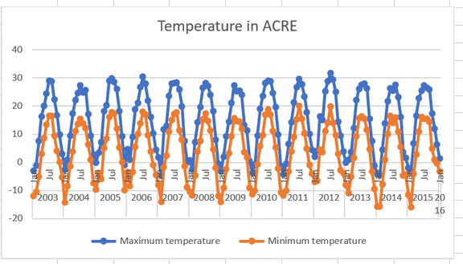

# Week 10 SGTA (Internal Offering)
# SGTA_01 

## Activity 1 - Weather data (15 minutes + 10 minutes discussion)

Upload the following CSV file into Excel Online. The file lists daily weather records for several weather stations.

* [weather_data.csv](weather_data.csv)

Create an Excel pivot table that converts this long table into a wide table so that:

* Each row shows the data for an entire year.
* There is a column for the maximum temperature, and another for the minimum temperature.
* Each cell in the pivot table shows the **average** values.

To do this, we suggest that you follow these steps:

1. Add a column that shows the **year** of the date. The easiest way to populate this column is to use Excel's YEAR formula.
2. Create the pivot table
3. Drag the correct fields so that years are shown as rows, type of measure is shown as columns.
4. Filter the columns so that they only show the maximum and minimum temperature

The final pivot table should look like this:


Answer the following questions:

1. What is the average maximum temperature in year 2003?
2. What is the average maximum temperature in year 2003 in **ACRE**?

## Activity 2 - Pivot charts in Excel (10 minutes + 5 minutes discussion)

Generate a pivot chart that shows a multi-line plot of the average maximum and minimum temperature of **ACRE**. The plot should look like this:


## Participation Task

Submit the Excel (.xlsx) file that shows the pivot table and chart of activities 1 & 2. After submission, show your result to your tutor so that your attendance can be recorded.


## OPTIONAL Activity 3 - Years and Months

Modify your pivot table so that the chart shows the monthly averages with these two variants:

1. Month of the year, regardless of the year: 


2. Month of the year and the year:



# SGTA_02 

## Activity 1 - MATLAB's Groupsummary - 15 minutes + 10 minutes discussion

Upload the following CSV file into MATLAB Online. This is the same file you used in SGTA 1.

* [weather_data.csv](weather_data.csv)

Write a MATLAB live script that does the following:

1. Import the contents of the file `weather_data.csv` and stores it in a variable with name `weather_data`. For this you can use the import data tool and generate the corresponding live script. You do not need to edit the defaults presented by the import data tool.

2. Create a new table that contains only the rows that correspond to the maximum temperature. Store the table in the variable `maximum_temperature`.

3. Using `groupsummary`, create a table that groups all values by month name. To do this, you must bin the `date` column using the option `monthname`. Store the resulting table in a variable with name `monthly_max_temperature`. The first rows of the table should look like this:


## Participation Task

Submit the MATLAB Live script (.mlx) file that shows the code for activity 1. After submission, show your result to your tutor so that your attendance can be recorded.


## OPTIONAL Activity 2 - MATLAB's unstack and groupsummary - 15 minutes + 10 minutes discussion

Extend the live script that you wrote for activity 2 so that it uses unstack and groupsummary in order to produce this table:


The following template is a guide of how you could achieve this:

```matlab
% remove the column "VarName1"
clean_table = removevars(weather_data, ...) 
% create a wide table based on the "param" column
wide_table = unstack(clean_table, ...) 
% Compute the average temperature per month
temperatures = groupsummary(wide_table, ...) 
% remove the appropriate columns
clean_temperatures = removevars(temperatures, ...) 
```

*Hint: You can specify a list of variables this way: `["MaximumTemperature" "MinimumTemperature"]`

## OPTIONAL Activity 3 - Correlation matrix (15 minutes + 10 minutes discussion)

The following CSV file has been downloaded from https://people.sc.fsu.edu/~jburkardt/data/csv/csv.html and contains 1034 records with various information from baseball players.

* [mlb_players.csv](mlb_players.csv)

Using MATLAB, write a live script that implements the follow:

1. Load the CSV file mlb_players.csv.
2. Compute the correlation matrix between the columns "Heightinches" and "Weightlbs". To compute the correlation matrix, use MATLAB's `corrcoef` function. Remember that this function needs a matrix as input, so you need to extract the columns from your table using the notation `{ ... }`.
